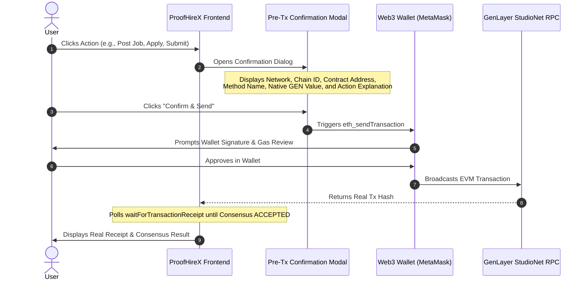

# ProofHireX Wallet Safety & Permission Specification

This document provides a comprehensive technical audit of the wallet interaction layer in ProofHireX. It certifies compliance with non-custodial, phishing-resistant, and permission-minimized Web3 standards.

---

## 1. Executive Summary & Guarantees

ProofHireX is designed to minimize attack surfaces and eliminate common Web3 wallet drainer vulnerabilities:

1. **Zero Token Approvals:** ProofHireX operates exclusively via **native GEN escrow**. It contains **no** ERC-20 token contracts and **never** calls `approve`, `permit`, `setApprovalForAll`, or `transferFrom`.
2. **Zero Arbitrary Signatures:** The application **never** requests off-chain message signatures. Calls to `personal_sign`, `eth_sign`, `eth_signTypedData`, and `eth_signTypedData_v4` are completely absent from the codebase.
3. **No Automatic Transactions on Connect:** Connecting your wallet invokes only `eth_requestAccounts` and an optional standard network switch. It **never** triggers an automatic transaction, deposit, or signature.
4. **Mandatory Pre-Transaction Confirmation:** Every state change requires explicit user initiation through a two-phase confirmation modal displaying network, chain ID, contract address, function name, native GEN value, and a human-readable explanation.
5. **Real Transaction Receipts:** The application never simulates progress with fake timers or mock validator rounds; it queries the actual GenLayer consensus receipt on StudioNet.

---

## 2. Exhaustive Audit of Web3 Provider Calls

A complete static analysis of the frontend codebase (`frontend/src/`) for standard Ethereum provider RPC methods confirms the following:

| Method / Call | Status in ProofHireX | Rationale & Safety Invariant |
|---|---|---|
| `window.ethereum` | **VERIFIED** | Detected passively; checked only when user interacts with wallet actions. |
| `eth_requestAccounts` | **VERIFIED** | Invoked **only** when the user explicitly clicks the "Connect Wallet" button. Never called on initial page load. |
| `eth_accounts` | **VERIFIED** | Passive read call on mount to detect already-connected accounts without prompting the user. |
| `eth_chainId` | **VERIFIED** | Passive read call to check whether the active network matches GenLayer StudioNet (`61999`). |
| `wallet_switchEthereumChain` | **VERIFIED** | Prompts wallet to switch to Chain ID `0xf22f` (`61999`). |
| `wallet_addEthereumChain` | **VERIFIED** | Configures GenLayer StudioNet with RPC `https://studio.genlayer.com/api` if the chain is not registered in the wallet. |
| `eth_sendTransaction` | **VERIFIED** | Triggered only after explicit user confirmation in the UI modal. Value is `0` for all calls except `create_job` (which locks the native escrow deposit). |
| `personal_sign` | **FORBIDDEN (0 calls)** | **Absent.** ProofHireX does not perform off-chain authentication or gasless message signing. |
| `eth_sign` | **FORBIDDEN (0 calls)** | **Absent.** Blind binary signing is completely prohibited. |
| `eth_signTypedData` | **FORBIDDEN (0 calls)** | **Absent.** No EIP-712 structured message signing is used. |
| `eth_signTypedData_v4` | **FORBIDDEN (0 calls)** | **Absent.** Eliminates any risk of Permit2 or ERC-2612 permit phishing drainers. |
| `approve` | **FORBIDDEN (0 calls)** | **Absent.** ProofHireX does not use ERC-20 tokens. Zero allowance risks. |
| `permit` | **FORBIDDEN (0 calls)** | **Absent.** No gasless signature approvals exist. |
| `setApprovalForAll` | **FORBIDDEN (0 calls)** | **Absent.** ProofHireX is not an NFT protocol and never requests operator allowances. |
| `transferFrom` | **FORBIDDEN (0 calls)** | **Absent.** Funds cannot be pulled from your wallet by a third-party contract. |
| `wallet_requestSnaps` | **REMOVED** | Previously invoked by experimental SDK helpers (`client.connect()`). Replaced with standard EVM chain switching to prevent wallet permission warnings. |

---

## 3. Why ProofHireX Cannot Drain Your Wallet

Phishing sites and malicious dApps typically employ one of three vectors:

### Vector 1: Unlimited ERC-20 Allowances (`approve` / `permit`)
- *How drainers work:* A malicious site presents a fake "Verify" or "Claim" button that actually signs an infinite token allowance (`approve(spender, 2^256 - 1)`) for USDT, USDC, or WETH. The attacker then drains the funds using `transferFrom`.
- *ProofHireX Defense:* ProofHireX operates **strictly in native GEN currency**. It has no ERC-20 contract dependencies, exposes no approval functions, and never asks for allowances. Even if an attacker compromised the frontend code, the underlying intelligent contract `0x24cA909D9fa2a680F4a8004A5EB15e78a20e4d64` has no ability to execute `transferFrom` on your wallet.

### Vector 2: Deceptive Off-Chain Signatures (`eth_signTypedData` / Permit2)
- *How drainers work:* A fake prompt presents a harmless-looking message that actually authorizes an off-chain Permit2 signature granting access to your tokens without generating an on-chain transaction record.
- *ProofHireX Defense:* ProofHireX contains **zero** calls to any signature method. Every user action is an explicit on-chain transaction that must be reviewed and signed through your wallet's standard transaction confirmation interface.

### Vector 3: Automatic Transaction Dispatch on Connect
- *How drainers work:* The user connects their wallet, and script immediately triggers an `eth_sendTransaction` with maximum balance transfer.
- *ProofHireX Defense:* ProofHireX's connection flow in `WalletContext.tsx` only queries `eth_requestAccounts` and `eth_chainId`. No transaction can be initiated without the user filling out a form (e.g. creating a job, applying, or submitting work), reviewing the pre-transaction prompt modal, and clicking "Confirm & Send".

---

## 4. Pre-Transaction Explicit Confirmation Modal

ProofHireX enforces a two-phase transaction execution flow:



Every transaction modal displays:
- **Network:** `GenLayer StudioNet`
- **Chain ID:** `61999` (`0xf22f`)
- **Contract Address:** `0x24cA909D9fa2a680F4a8004A5EB15e78a20e4d64`
- **Method Name:** Exact intelligent contract method (`create_job`, `apply_for_job`, etc.)
- **Native GEN Value:** Explicitly states `0.00 GEN` for state changes, or exact deposit amount (e.g., `1.00 GEN`) for job creation.
- **Human-Readable Explanation:** Clear breakdown of what state change will occur.
- **Buttons:** Explicit **Confirm & Send** and **Cancel** buttons.

---

## 5. User Safety Checklist Before Interacting

When interacting with ProofHireX (or any decentralized application on GenLayer StudioNet):

1. **Verify Contract Address:** Always confirm that the destination address shown in your wallet popup matches:
   ```
   0x24cA909D9fa2a680F4a8004A5EB15e78a20e4d64
   ```
2. **Verify Network & Chain ID:** Ensure your wallet is connected to **GenLayer StudioNet** (Chain ID: `61999`, hex: `0xf22f`).
3. **Check Native Value:** Only `create_job` requires sending native GEN value (your escrow deposit). All other calls (`apply_for_job`, `hire_freelancer`, `submit_milestone_deliverable`, `verify_milestone_deliverable`, `approve_milestone_manual`, `raise_dispute`, `arbitrate_dispute`, `withdraw`) require **0 GEN** value (only network gas).
4. **Use a Burner Wallet:** For testing and evaluating hackathon dApps on StudioNet, always use a dedicated testnet wallet that does not hold mainnet assets or critical keys.
